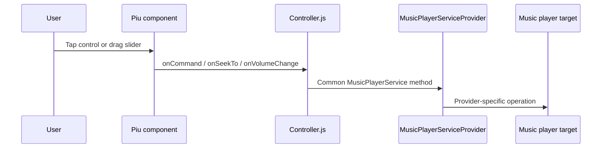
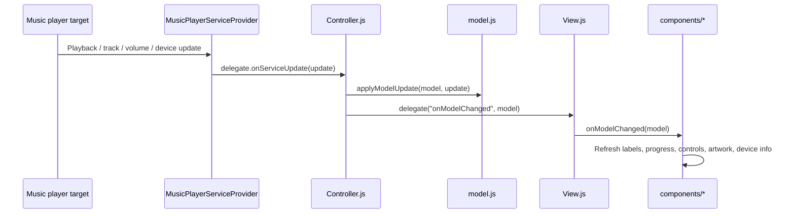
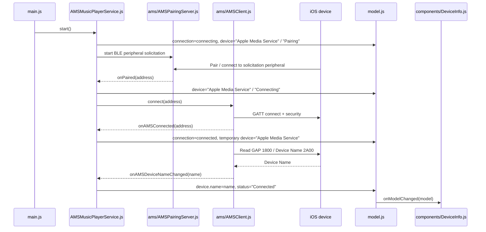
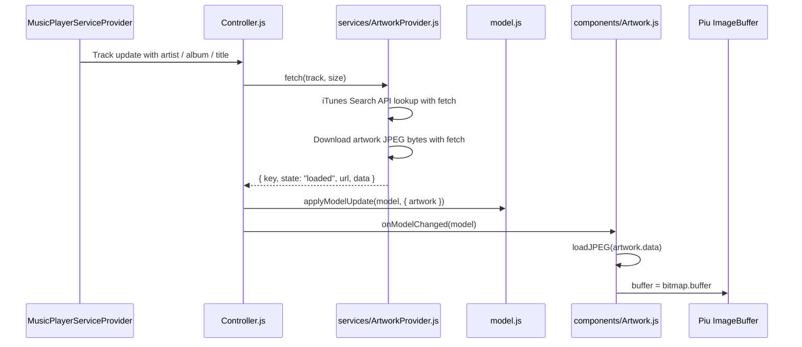

# Agent Guide

This is the developer-facing guide for coding agents and maintainers. Keep README user-facing; put implementation boundaries, architecture notes, and validation rules here.

## Project Shape

```text
src/
├─ main.js
├─ manifest.json
├─ assets.js
├─ model.js
├─ Controller.js
├─ View.js
├─ components/
│  ├─ MusicPlayer.js
│  ├─ Artwork.js
│  ├─ TrackInfo.js
│  ├─ Progress.js
│  ├─ Controls.js
│  ├─ Volume.js
│  └─ DeviceInfo.js
└─ services/
   ├─ MusicPlayerService.js
   ├─ MockMusicPlayerService.js
   ├─ AMSMusicPlayerService.js
   ├─ ArtworkProvider.js
   ├─ MusicPlayerServiceProvider.js
   └─ ams/
      ├─ AMSClient.js
      └─ AMSPairingServer.js
```

## Current Defaults

- Target layout: 240x320 portrait, centralized in `src/assets.js` as `Layout`.
- Initial build target: `sim`.
- Initial service: `MockMusicPlayerService`, selected by default manifest mapping.
- Real AMS service: `AMSMusicPlayerService`, selected only for `esp32/*` platforms through manifest mapping.
- AMS device name display: read from BLE Generic Access service `1800` / Device Name characteristic `2A00` after GATT security; AMS Player `NAME` is an app/player name and must not overwrite `model.device.name`.
- Artwork fetch: `ArtworkProvider`, backed by the iTunes Search API and Moddable `fetch`, returns JPEG bytes in the model as `{ key, state, url, data }`.
- Artwork display: `components/Artwork.js` decodes model artwork bytes with `commodetto/loadJPEG` and passes `bitmap.buffer` to Piu `ImageBuffer`.
- TLS for current iTunes/mzstatic artwork fetch uses `$(MODDABLE)/modules/crypt/data/ca170` in `src/manifest.json`.

## Rules

- Keep Piu UI code in `src/View.js` and `src/components/`.
- Keep BLE, AMS, HTTP, TLS, and artwork fetch logic in `src/services/`.
- Keep playback state shape centralized in `src/model.js`.
- Route user input through `Controller.js`; components should not call services directly.
- Treat `MusicPlayerService.js` as the common media-player contract. Put provider-specific behavior in concrete services and wire them through the `MusicPlayerServiceProvider` manifest alias.
- Prefer simulator-safe mocks until a task explicitly targets hardware.
- Do not add real AMS manifest includes to the default simulator path in `src/manifest.json` unless implementing and validating the hardware path.
- Keep artwork JPEG decoding and display in `src/components/Artwork.js` using `commodetto/loadJPEG` and Piu `ImageBuffer`; do not add custom native drawing for artwork unless `ImageBuffer` is proven insufficient.

## Responsibilities

- `main.js` creates the model, service provider, controller, and Piu application.
- `model.js` owns the shared playback, connection, track, artwork, volume, and device state shape.
- `Controller.js` translates service updates into model updates, forwards user commands to the service, and starts artwork fetches when track identity changes.
- `View.js` assembles the top-level screen.
- `components/` contains Piu UI templates and touch handling only.
- `services/` contains UI-independent media, AMS, mock, network, and artwork lookup logic.
- `ArtworkProvider.js` resolves album artwork through iTunes Search API and downloads JPEG bytes. It must not import Piu.
- `components/Artwork.js` displays already-fetched artwork bytes. It must not fetch.
- `services/ams/AMSClient.js` owns GATT service discovery, AMS subscriptions, GAP Device Name reads, and AMS entity parsing.
- `services/ams/AMSPairingServer.js` owns the short-lived BLE peripheral pairing/solicitation flow used before the app opens an AMS GATT client connection.

## Runtime Sequences

`main.js` wires model, controller, service, and view. The controller is the boundary between UI intent and service behavior.

### GUI Operation To Music Player



Components translate touch events into controller calls. They do not call BLE, AMS, HTTP, mock services, or artwork services directly.

### Music Player Update To GUI



Services emit partial update objects. `Controller.js` merges them into the model, and `View.js` fans the updated model out to screen-level components.

### AMS Pairing, Connection, And Device Name



`AMSClient` reads the BLE Generic Access Device Name after `onSecured`, in parallel with AMS service discovery. Failure to read GAP Device Name must be logged but must not fail the AMS connection. AMS Player entity `NAME` is still parsed into `state.player.name` for future use, but it is the media player/app name, not the peer device name; do not map it to `model.device.name`.

### AMS Characteristics

`AMSClient.js` discovers the Apple Media Service `89D3502B-0F36-433A-8EF4-C502AD55F8DC` and treats these characteristics as the required AMS surface:

| Characteristic | UUID | Usage |
| --- | --- | --- |
| Remote Command | `9B3C81D8-57B1-4A8A-B8DF-0E56F7CA51C2` | Subscribe for the supported remote-command list, then write command IDs to control playback. |
| Entity Update | `2F7CABCE-808D-411F-9A0C-BB92BA96C102` | Subscribe for player/track notifications, then write entity/attribute request lists to select updates. |
| Entity Attribute | `C6B2F38C-23AB-46D8-A6AB-A3A870BBD5D7` | Do not subscribe. Write `{ entityID, attributeID }`, then read the characteristic to fetch full attribute text when notifications are truncated or incomplete. |

Only `Remote Command` and `Entity Update` are subscription characteristics in this app. Keep that distinction explicit in `AMSClient.js`: `Entity Attribute` is required for follow-up reads, but adding it to the subscription sequence is incorrect.

`AMSClient.js` requests a larger GATT MTU before security and AMS discovery so `Entity Update` notifications and `Entity Attribute` reads can carry longer track metadata than the default 23-byte ATT MTU allows. If a title/artist/album is still longer than the negotiated MTU payload, the current embedded BLE client API may still return a partial value because it does not expose repeated read-blob offsets.

### Artwork Fetch And Display



Artwork follows the same ownership boundary as the rest of the app. Network and TLS concerns stay in `ArtworkProvider`; display-only decoding stays in `Artwork.js`.

## Validation

- Run `npm run check` before handing work back.
- For simulator build validation only, run `cd src && mcconfig -d -m -p sim -t build`.
- Use `npm run debug:sim` for `mcconfig -dl -m -p sim` and inspect debugger commands with `help`.
- Do not use `mcrun` for this project unless a later task explicitly changes the workflow.

## Reference Implementation Sources

When adding Apple Media Service behavior, consult the local Moddable SDK:

- `$(MODDABLE)/examples/network/ble/ios-media-sync/main.js`
- `$(MODDABLE)/examples/network/ble/ios-media-sync/manifest.json`
- `$(MODDABLE)/modules/network/ble/ams-client/amsclient.js`

For artwork/image display behavior, useful references are:

- `$(MODDABLE)/examples/io/imagein/camera/camera-test/main.js`
- `$(MODDABLE)/modules/piu/MC/imageBuffer`
- `$(MODDABLE)/modules/commodetto/commodettoLoadJPEG.js`

The AMS adapter should expose the same public command names already used by `MusicPlayerService`: `start`, `stop`, `play`, `pause`, `togglePlayPause`, `nextTrack`, `previousTrack`, `seekTo`, and `setVolume`.
