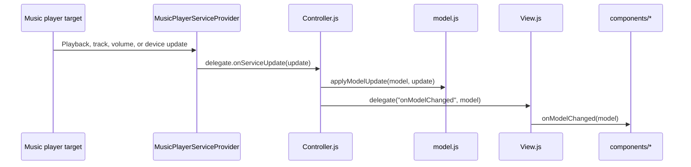

# Apple Media Service media player

A Moddable Piu media player GUI designed for a 240x320 display.

It displays track information, album artwork, playback position, volume, and the connected device, and provides touch
controls for playback. The simulator uses a mock service, while ESP32 builds connect to an iPhone through Apple Media
Service (AMS). The BLE implementation is included from [`modules/ams`](../../modules/ams/).

## Features

- Track title, artist, and album artwork
- Play, pause, next track, and previous track controls
- Playback position and volume sliders
- Connected device name read from BLE Generic Access
- Album artwork fetched through the iTunes Search API

## Simulator

Build from the repository root:

```sh
npm run build:sim
```

To start the debugger:

```sh
npm run debug:sim
```

## ESP32

AMS requires an ESP32 target with BLE support.

```sh
cd examples/ams-media-player
mcconfig -d -m -p esp32/moddable_two
```

The ESP32 build briefly acts as a BLE peripheral to initiate pairing with the iPhone, then reconnects as an AMS GATT
client. Simulator builds do not load the BLE modules.

## Artwork

Album artwork is downloaded as JPEG data through the iTunes Search API, so artwork display requires a network connection.

## Application Data Flow



Components send touch intent to `Controller.js`. The controller invokes the common `MusicPlayerService` API; components
never call BLE, AMS, HTTP, mock, or artwork services directly.
