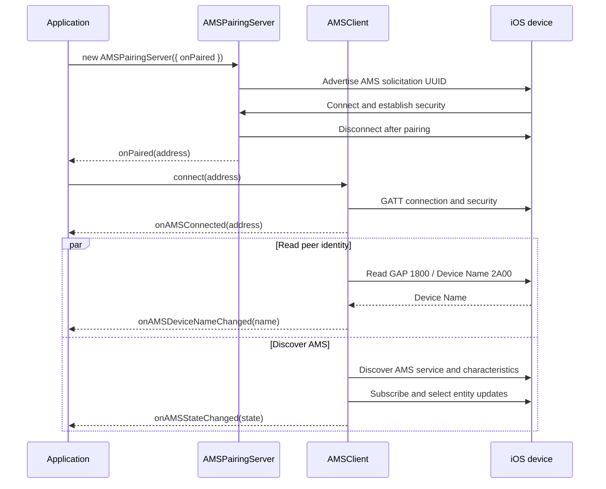

# Apple Media Service module

Provides a BLE GATT client for Apple Media Service (AMS) and a short-lived peripheral server used for initial pairing
with an iPhone. It does not depend on Piu or an application-specific model.

## Include

Include the module from the application's `manifest.json`:

```json
{
	"include": ["../../modules/ams/manifest.json"]
}
```

The manifest exposes these module imports:

```js
import { AMSClient, RemoteCommandID } from "moddablue/ams/client";
import AMSPairingServer from "moddablue/ams/pairing-server";
```

See [`examples/ams-media-player/services/AMSMusicPlayerService.js`](../../examples/ams-media-player/services/AMSMusicPlayerService.js)
for a working example of the `AMSClient` delegate callbacks and state format.

The module manifest also includes the Moddable manifests required for BLE central, BLE peripheral, and `TextDecoder`.

## Pairing And Connection Sequence



Failure to read the GAP Device Name is non-fatal and does not stop AMS discovery. The Player entity `NAME` attribute is
the media player or app name, not the peer device name.

## Characteristics

| Characteristic | UUID | Usage |
| --- | --- | --- |
| Remote Command | `9B3C81D8-57B1-4A8A-B8DF-0E56F7CA51C2` | Subscribe to receive the supported-command list, then write command IDs to control playback. |
| Entity Update | `2F7CABCE-808D-411F-9A0C-BB92BA96C102` | Subscribe to player and track notifications, then write entity/attribute request lists to select updates. |
| Entity Attribute | `C6B2F38C-23AB-46D8-A6AB-A3A870BBD5D7` | Do not subscribe. Write `{ entityID, attributeID }`, then read to retrieve complete text when an update is truncated. |

The client requests a larger GATT MTU before security and discovery. Metadata longer than the negotiated payload may
still be partial because the current embedded BLE client API does not expose repeated read-blob offsets.

## Delegate Callbacks

- `onAMSConnected(address)` — the GATT connection is ready
- `onAMSDeviceNameChanged(name)` — the GAP Device Name was read successfully
- `onAMSStateChanged(state)` — player, playback, or track state changed
- `onAMSError(error)` — connection or required AMS discovery failed
