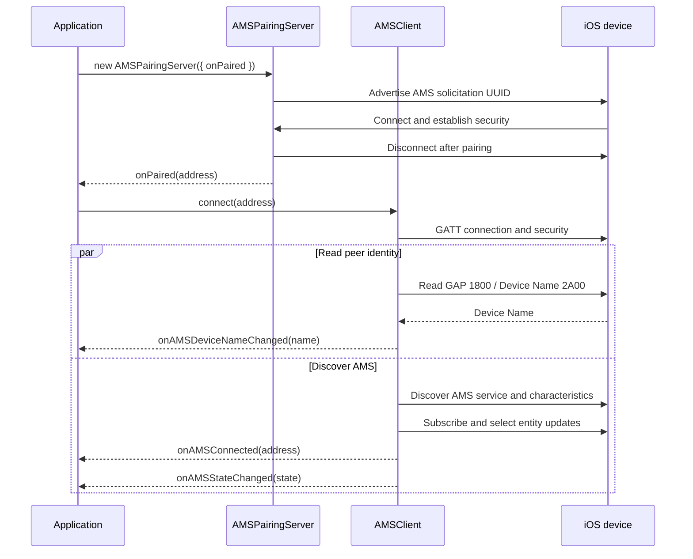

# Apple Media Service module

Provides a BLE GATT client for Apple Media Service (AMS) and a short-lived peripheral server used for initial pairing
with an iPhone. It does not depend on Piu or an application-specific model.

## Include

Include only the APIs the application uses:

```json
{
	"include": [
		"../../modules/ams/manifest-client.json",
		"../../modules/ams/manifest-pairing-server.json"
	]
}
```

`manifest-client.json` exposes `moddablue/ams`; `manifest-pairing-server.json` exposes
`moddablue/ams/pairing-server`. The aggregate `manifest.json` includes both for compatibility.

The manifest exposes these module imports:

```js
import { AMSClient, RemoteCommandID } from "moddablue/ams";
import AMSPairingServer from "moddablue/ams/pairing-server";
```

The previous `moddablue/ams/client` import remains available as a compatibility alias. The pairing server keeps its
role suffix because applications select it separately from the client.

See [`examples/ams-media-player/services/AMSMusicPlayerService.ts`](../../examples/ams-media-player/services/AMSMusicPlayerService.ts)
for a working example of the `AMSClient` delegate callbacks and state format.

Each focused manifest includes only its required Moddable BLE role. The client manifest also includes `TextDecoder`.

## Quick start

```js
import { AMSClient, RemoteCommandID } from "moddablue/ams";
import AMSPairingServer from "moddablue/ams/pairing-server";

const delegate = {
	onAMSConnected(address) {
		trace(`AMS ready at ${address}\n`);
		if (!client.remoteCommand(RemoteCommandID.PLAY))
			trace("PLAY is not available yet or is not supported\n");
	},
	onAMSStateChanged(state) {
		trace(`title=${state.track.title ?? "unknown"}\n`);
	},
	onAMSError(error) {
		trace(`AMS error: ${error}\n`);
	},
};

const client = new AMSClient(delegate);
const pairing = new AMSPairingServer({
	deviceName: "My AMS Remote",
	onPaired(address) {
		client.connect(address);
	},
});
```

Keep both `client` and `pairing` reachable for the lifetime of the session. Pairing uses Just Works bonding and does not
require a passkey UI.

## Pairing server API

`new AMSPairingServer(options?)` starts advertising when its GATT server is ready. It accepts:

| Option | Default | Description |
| --- | --- | --- |
| `deviceName` | `"AMS Client"` | GAP Device Name exposed by the pairing peripheral. |
| `advertisedDeviceName` | `"AMS"` | Name placed in the pairing advertisement. |
| `batteryLevel` | `100` | Static Battery Level value exposed during pairing. |
| `onPaired(address)` | `undefined` | Called with the bonded peer address after the pairing connection disconnects. |

The pairing server advertises the AMS solicitation UUID, bonds with the iPhone, stops advertising, disconnects, and then
calls `onPaired(address)`. The current pairing-server API has no public restart or close method; create one instance for
the pairing session.

## Client API

### Create and connect

`new AMSClient(delegate)` stores the delegate used for all callbacks. `connect(address)` starts a bonded central
connection to the address returned by the pairing server and returns `false` if this client already has a GATT
connection; otherwise it returns `true` after starting the attempt.

The `connected` getter only reports whether the client currently owns a GATT connection object. It does not mean AMS
discovery and subscriptions are ready. Wait for `onAMSConnected(address)` before issuing remote commands.

The current client API has no public disconnect or close method. A transport error clears its internal connection
state and invokes `onAMSError(error)`.

### Send remote commands

`remoteCommand(command)` returns `false` until AMS is ready, when the phone did not advertise that command as supported,
or when the required characteristic is unavailable. It returns `true` when the write was scheduled. A later write
failure is written to the debug trace and does not change the return value.

`RemoteCommandID` contains:

| Constant | Value | Constant | Value |
| --- | ---: | --- | ---: |
| `PLAY` | 0 | `PAUSE` | 1 |
| `TOGGLE_PLAY_PAUSE` | 2 | `NEXT_TRACK` | 3 |
| `PREVIOUS_TRACK` | 4 | `VOLUME_UP` | 5 |
| `VOLUME_DOWN` | 6 | `ADVANCE_REPEAT_MODE` | 7 |
| `ADVANCE_SHUFFLE_MODE` | 8 | `SKIP_FORWARD` | 9 |
| `SKIP_BACKWARD` | 10 | `LIKE_TRACK` | 11 |
| `DISLIKE_TRACK` | 12 | `BOOKMARK_TRACK` | 13 |

### Read current state

`sample()` returns the live state object retained by the client. The same object is updated in place and passed to
`onAMSStateChanged(state)`, so copy it if the application needs an immutable snapshot.

```js
{
	deviceName, // optional GAP Device Name of the paired phone
	player: {
		name,   // optional current media-player or app name
		volume, // optional number reported by AMS, normally 0 through 1
	},
	playback: {
		state,   // optional: 0 paused, 1 playing, 2 rewinding, 3 fast-forwarding
		rate,    // optional numeric playback rate
		elapsed, // optional elapsed seconds
	},
	track: {
		artist,
		album,
		title,
		duration, // optional duration in seconds
	},
}
```

Fields are absent until the corresponding AMS update is received. Track text is read through Entity Attribute even
when the notification is not marked truncated. The current embedded BLE client cannot perform repeated long reads, so
text longer than the negotiated payload may remain partial.

## Pairing and connection sequence


```mermaid
sequenceDiagram
    participant App as Application
    participant Pairing as AMSPairingServer
    participant Client as AMSClient
    participant Phone as iOS device

    App->>Pairing: new AMSPairingServer({ onPaired })
    Pairing->>Phone: Advertise AMS solicitation UUID
    Phone->>Pairing: Connect and establish security
    Pairing->>Phone: Disconnect after pairing
    Pairing-->>App: onPaired(address)
    App->>Client: connect(address)
    Client->>Phone: GATT connection and security
    par Read peer identity
        Client->>Phone: Read GAP 1800 / Device Name 2A00
        Phone-->>Client: Device Name
        Client-->>App: onAMSDeviceNameChanged(name)
    and Discover AMS
        Client->>Phone: Discover AMS service and characteristics
        Client->>Phone: Subscribe and select entity updates
        Client-->>App: onAMSConnected(address)
        Client-->>App: onAMSStateChanged(state)
    end
```

Failure to read the GAP Device Name is non-fatal and does not stop AMS discovery. The Player entity `NAME` attribute is
the media player or app name, not the peer device name.

## Characteristics

| Characteristic | UUID | Usage |
| --- | --- | --- |
| Remote Command | `9B3C81D8-57B1-4A8A-B8DF-0E56F7CA51C2` | Subscribe to receive the supported-command list, then write command IDs to control playback. |
| Entity Update | `2F7CABCE-808D-411F-9A0C-BB92BA96C102` | Subscribe to player and track notifications, then write entity/attribute request lists to select updates. |
| Entity Attribute | `C6B2F38C-23AB-46D8-A6AB-A3A870BBD5D7` | Do not subscribe. Write `{ entityID, attributeID }`, then read to retrieve complete text when an update is truncated. |

The client requests a larger GATT MTU before security and discovery. Metadata longer than the negotiated payload may
still be partial because the current embedded BLE client API does not expose repeated read-blob offsets.

## Delegate callbacks

All callbacks are optional:

| Callback | When it runs |
| --- | --- |
| `onAMSConnected(address)` | Security, required discovery, subscriptions, and entity-update selection are ready. |
| `onAMSDeviceNameChanged(name)` | The peer's GAP Device Name was read and decoded successfully. This can occur independently of readiness. |
| `onAMSStateChanged(state)` | A recognized player, playback, or track field changed. Receives the live state object described above. |
| `onAMSError(error)` | The transport failed, or required AMS discovery, subscription, or update selection failed. |

Failure to read the optional GAP Device Name is logged but does not invoke `onAMSError` or stop AMS discovery. Remote
command write failures are also logged rather than forwarded to the delegate.

## Exports

`moddablue/ams` exports the `AMSClient` class and frozen `RemoteCommandID` object. The pairing module exports
`AMSPairingServer` as its default export. These JavaScript modules do not yet publish TypeScript declarations; the
shapes documented here describe their current public contract.
